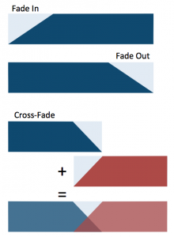

# Project 1: Audacity and cross fading

**Project 1 due: Tuesday, January 20, 2026 by 11:59PM Eastern**

**Peer grading opens: Wednesday, January 21, 2026 by 11:59PM Eastern**

**Peer grading due: Tuesday, January 27, 2026 by 11:59PM Eastern**

In this project, you will work with fade-in, fade-out, cross-fade, and then construct a sound collage composition. Before getting started, we’ll take a moment to discuss a critical aspect of digital audio that is too fundamental to ignore: _clipping_.

## Clipping

Digital-to-analog converters have a limited output range that is typically considered to be -1 to +1. If you try to output a higher or lower value, the actual sample is limited (or _clipped_) to be within range. This causes harsh and unpleasant distortion.

When editing, audio samples are typically stored as floating point numbers, so exceeding the (nominal) maximum amplitude is OK. But when you you export, samples are converted to 16-bit integers (more compatible with D/A converters) and that’s where clipping occurs. Once clipped, there is no good way to recover the lost information.

To avoid clipping, you must keep the maximum amplitude within the -1 to +1 range. One fix is to simply lower the amplitude of everything before exporting your sound. If clipping is due to one particular spot, it can be better to change that particular spot rather than re-scale everything. For example, you might use an envelope to lower the amplitude in the trouble spot. However, as a general rule, you should never edit individual samples, change amplitude abruptly, or change the amplitude of a very short region. All of these changes are themselves likely to produce audible problems.

Audacity has an option (View: Show Clipping (on/off)) to highlight audio samples that are out of range, but depending on track Gain settings and how many tracks you mix together, exported audio can still clip even if there is no clipping in individual tracks. This view feature is more useful to inspect recordings or exported audio. If you discover clipping, the best fix is to go back and re-record or re-mix to eliminate the problem.

## Fade in, Fade Out, Cross-Fade

A _fade in_ is used to eliminate a sudden onset of sound. Instead, the beginning of a sound is multiplied by a scale factor that smoothly progresses from 0 to 1 during the fade-in period.

A _fade out_ is used to eliminate a sudden offset of sound. Instead, the end of the sound is multiplied by a scale factor that smoothly progresses from 1 to 0 during the fade-out period.

_Cross-fading_ is a technique for splicing that avoids the sudden transition of an instantaneous cut from one sound to another. Instead, the sounds are overlapped slightly, and during the overlap, one sound fades out while the other sound fades in.

You should be familiar with these terms, as you will use these techniques throughout the course. As a reminder, here’s a schematic to illustrate these terms. Remember that, when incorporating sounds into compositions, any sound without a “natural” beginning and ending should be edited with a fade-in and fade-out to avoid clicks and pops at the beginning and ending. When joining sounds together, one often overlaps the fade-out of one sound with the fade-in of the next sound, creating a cross-fade.

Notice the fades here are _linear_, that is, following a straight line. Other curves are possible, but for this project, stick to linear fades. In particular, Audacity’s Envelope tool creates exponential fades. An exponential shape does not work for cross-fades because it leaves a “hole” in the middle of the cross-fade where the fading-out sound and the fading-in sound are both at a relatively low level.

## Instructions

- Obtain one or more sounds from [freesound.org](https://freesound.org). (You may also record sounds of your own, including voice.) The sound should be at least 3 seconds long. Please avoid using copyrighted sound. Please save the original sound file.
- Select a clip with length 3 to 5 seconds from the chosen sound and save the selection (e.g. in Audacity, export just the selection) to `sound0.wav` (or `.aiff`). Your `sound0` should have an abrupt beginning and ending; there may be a clicking noise due to jump in the waveform.
- Make a 1-second-long cross-fade from a copy of `sound0` to another copy of `sound0`. This means the first copy of the sound will fade out over 1 second while simultaneously the second copy fades in over 1 second, with the two sounds overlapping during this 1 second period. Then, operating on the combined (spliced) sound, fade out over 2 seconds. Call this `sound1` and save it to `sound1.wav` or `sound1.aiff`.
- Using `sound0` again, make a 20-ms-long cross-fade from the sound to a copy of itself. Then, operating on the combined (spliced) sound, fade out over 100 ms. Call this `sound2` and save it to `sound2.wav` or `sound2.aiff`.
- Use Audacity to manipulate your sounds using splicing, mixing, and any effects you wish. The final mix should have a duration of 30 to 60 seconds. Your sound should either be a soundscape — layers of sound with different amplitude, panning, and effects — or a “beat” — a rhythmic sequence that loops. In either case, you should construct something original rather than using a ready-made sound. You may use outside sources of sound **in addition** to your `sound0` (e.g. voice memos, other assets from freesound.org).  Use the envelope controls in Audacity to shape the loudness contour. E.g. you can fade in and out, ramp up to a climax, or create rhythm with amplitude change. Some form of loudness control should be obvious in your result. Your composition may be mono or stereo. Save this to `comp.wav` or `comp.aiff`.
- Create an ASCII text file (.txt) (not Word, not PDF, not HTML) named `answers.txt` with short answers to the following:
  - What was your intention in the design/composition of your sound?
  - State the duration of your sound from **your composition**. To help our autograder, type a string exactly in the form: `DURATION=37S` (Note: all caps including “`S`”, no spaces, state the decimal integer number of seconds – rounded from the true duration – followed by capital `S`. The string “`DURATION=`” should appear only once in the file.)
  - Compute the size of the sound file assuming you save the file as a single-channel `.wav` file with 16-bit samples and a 44kHz sample rate. Does the number match the true size? To help our autograder, type a string exactly in the form: `SIZE=180MB`. (Again, all caps, no spaces, state the rounded-to-integer decimal number of megabytes – 1,000,000 bytes = 1MB – and “`SIZE=`” should appear only once with your answer.)
  - Consent to highlight your composition in class or on website, opt-in; choose True/False for each of the following:
    - Share audio: True/False
    - Share name: True/False
    - Share text for intent and description: True/False
- Submit files in a zip file. The following files should be at the top level in your zip file (you may use `.aiff` sound files instead of `.wav` sound files):
  - `sound0.wav`: original sound0 with abrupt beginning and ending used to create sound1 and sound2.
  - `sound1.wav`: cross-fade/fade-in/fade-out sound, 1s cross-fade, 2s fade
  - `sound2.wav`: cross-fade/fade-in/fade-out sound, 20ms cross-fade, 100ms fade
  - `origin/`: a folder that contains the all the original sound files for your composition; if you have more than 10MB or 1 minute of sound, include representative sounds, keeping the total data in origin/ under 10MB.
  - `comp.wav`: your composition
  - `answers.txt`: short answers
  - `comp_README.txt`: optional additional info on your composition
  - `origin/README.txt`: optional credits and info on your source material
- Getting the right files in the right place is crucial. Unzip your file into a fresh location and check the resulting directory for each of the files and directories above. For example, your submission could contain the following:
  - `sound0.aiff`
  - `sound1.aiff`
  - `sound2.aiff`
  - `origin/sound.aiff`
  - `comp.aiff`
  - `comp_README.txt`
  - `answers.txt`
  - _Important_: The files should be zipped at the top level. If, when you unzip your file, a subdirectory is created, e.g. if instead of seeing `sound0`.aiff you see `myproject1/sound0.aiff`, then your zip file will not be accepted.
- Grading is based on the following points:
  - Your cross-faded sounds should be correctly constructed.
  - Your answers for duration and size should be correct.
  - Your composition should not have any clipping.
  - Your composition should use the Audacity envelope tool or equivalent to make obvious loudness contrasts.
  - Your composition should show other editing or processing techniques.
  - Your composition should engage the listener.

## Common Problems

### Clipping

If auto-grading complains about clipping, it means that either some original sound was clipped to begin with, or when you mixed or added effects, the resulting sound exceeds the range of audio samples, resulting in truncation and audio distortion.

- _Original Sound Clipped_. Look at your original sound in Audacity. In the View menu, enable "Show Clipping". Any red line in the waveform display indicates clipping. You can zoom in to get a better view. Unfortunately, this clipping is "baked in" and the best solution is re-record at a lower level or find another sound.
- _Clipping In Your Mix_. Go back to your mixing project and reduce the levels of some tracks with the per-track Gain controls, or maybe you have a Master Gain control. Export the mix. You should always check the final mix for clipping; e.g., load it into Audacity with "Show Clipping" enabled.

### Linear Cross-Fades

You must use linear fade-out and fade-in for sound1 and sound2. If you are not sure whether your editor is doing this, generate and fade some white noise. Export the sound, then load it and inspect the waveform visually. You should be able to tell if the fade goes in a straight line (linear) or some other curve (possibly an exponential curve).

### Normalization

For sound1 and sound2, make sure your editor does not normalize levels when exporting the edited sound. Load sound0, sound1, and sound2 into separate tracks and inspect them to see if they even _look_ like what you expect, e.g. sound1 and sound2 look like sound0 at the beginning with the same level, splices are in the right place, durations are correct, etc.
