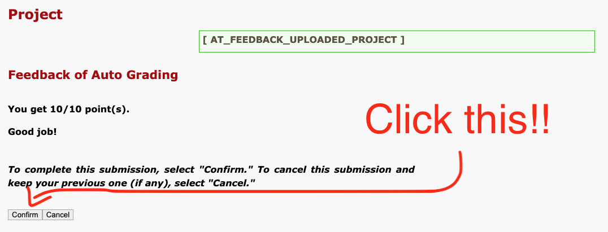

## FAQ

### I submitted my project before the deadline - why is my grade a 0?

You may have forgotten to click the "Confirm" button after receiving your auto grade. Unfortunately we can't accept this as an excuse as we have no way of determining if you were actually finished ahead of time. Please be careful!

## Latest Nyquist setup instructions

- Install the Java JDK (if you haven’t already):
  - Download JDK 17 from https://www.oracle.com/java/technologies/downloads/#java17 for your specific operating system and run the installer
  - **Note**: For Macbooks w/ Apple silicon (M1/M2/M3), make sure to select the “ARM64 DMG Installer”
  - **Note**: Make sure you install a recent version of the JDK (>=17). Other common installations of Java (e.g., JRE Version 8) will _not_ run NyquistIDE.
- Install Nyquist
  - Download [latest version of Nyquist](https://sourceforge.net/projects/nyquist/files/nyquist/3.24) and run installer
    - **Note**: For newer Macs w/ Apple Silicon (M1/M2/M3), download `nyquist-install-arm-324.dmg`. For Macs w/ Intel chips, download `nyquist-install-intel-324.dmg`
  - macOS installation
    - Open `nyquist-install-{arm,intel}-324.dmg`
    - Open Finder
    - Press Cmd+Shift+H to navigate to your home directory, drag the “nyquist” folder into it
    - Click on “Applications” on the left side and drag “NyquistIDE” into it
    - Ctrl+Click on NyquistIDE in your Applications and press “Open”
  - Windows installation
    - Double click on `setupnyqiderun324.exe`
    - Click “Run Anyway”
    - Additional troubleshooting information can be found here: https://www.cs.cmu.edu/~rbd/doc/nyquist/index.html

## Alternative: Nyquist via VSCode

We strongly recommend that students use NyquistIDE when programming in Nyquist this semester. However, as an **experimental alternative**, we have also created a VSCode extension allowing for basic Nyquist development.

This extension is [known](https://github.com/chrisdonahue/nyquist-vscode/issues) to have incomplete functionality relative to NyquistIDE. Use at your own risk. If you encounter any programming or project issue and are using the VSCode extension instead of NyquistIDE, the first thing you should do to debug is try NyquistIDE.

First, [install Nyquist](#latest-nyquist-setup-instructions). Then:

1. Grab the latest `.vsix` build from https://github.com/chrisdonahue/nyquist-vscode/releases
1. Open VSCode and drag the `.vsix` file into your extensions.
1. Configure the `nyquist.interpreterPath` and `nyquist.xlispPath` settings in [VSCode](https://github.com/chrisdonahue/nyquist-vscode?tab=readme-ov-file#setup-macos-with-nyquistide) to point to your Nyquist installation
1. You may also need to instruct VSCode to associate `.sal` files w/ the Nyquist SAL language, see image below
1. Press `Cmd+Shift+R` (Mac) / `Ctrl+Shift+R` (Win/Linux) to run current file

If you are particularly eager, contributions to this extension are welcome! You may [open a pull request](https://github.com/chrisdonahue/nyquist-vscode) to the core repo. Key features requests are tracked [here](https://github.com/chrisdonahue/nyquist-vscode/issues).

## Other resources

- [Nyquist user manual](https://www.cs.cmu.edu/~rbd/doc/nyquist/index.html)
- [Audacity user manual](https://manual.audacityteam.org/)
- [ICM Playlist (by Jesse Stiles)](https://open.spotify.com/playlist/3VzPJ5idcjoZghHjuQAZUT?si=IrCH_oZfQqOqoe-RcwN94w&nd=1)
- [Max demos (from Jesse Stiles)](https://drive.google.com/drive/folders/1wC5iP-rP6jvPopqGFO_vD7q6m7Aquwxr)
- Other optional textbooks and resources:
  - [_Algorithmic Composition_](https://press.umich.edu/Books/A/Algorithmic-Composition2) by Mary Simoni and Roger B. Dannenberg. [Link to electronic version in CMU library](https://cmu.primo.exlibrisgroup.com/discovery/fulldisplay?docid=alma991019513995704436&context=L&vid=01CMU_INST:01CMU&lang=en&search_scope=MyInst_and_CI&adaptor=Local%20Search%20Engine&tab=Everything&query=any,contains,algorithmic%20composition).
  - [_The Computer Music Tutorial_](https://www.amazon.com/Computer-Music-Tutorial-second-dp-0262044919/dp/0262044919/ref=dp_ob_title_bk) by Curtis Roads. [Link to electronic version in CMU library](https://cmu.primo.exlibrisgroup.com/discovery/fulldisplay?docid=alma991019486715904436&context=L&vid=01CMU_INST:01CMU&lang=en&search_scope=MyInst_and_CI&adaptor=Local%20Search%20Engine&isFrbr=true&tab=Everything&query=any,contains,computer%20music%20tutorial&sortby=date_d&facet=frbrgroupid,include,9019777044576965786&mode=Basic&offset=0). Broader in scope than this course.
- [International computer music association](http://www.computermusic.org/)
